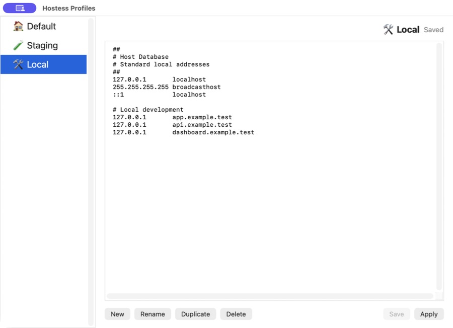
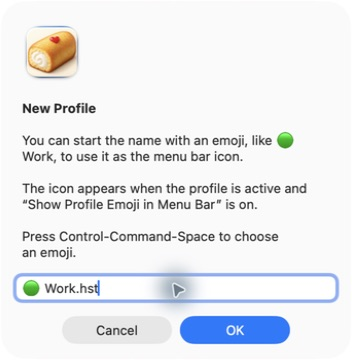

# Hostess

Hostess is a standalone macOS menu bar app for switching hosts-file profiles.

## Install with Homebrew

Homebrew is the supported installation method. Install from this project's tap:

```bash
brew tap kat3samsin/hostess https://github.com/kat3samsin/hostess.git
brew install --cask kat3samsin/hostess/hostess
```

The tap installs the current Apple Silicon release for macOS 13 or later. It is ad hoc signed and not notarized. Open Hostess from Applications, then approve it in **System Settings → Privacy & Security → Open Anyway** if macOS blocks its first launch.

This release requires administrator approval for profile changes. Installing through Homebrew does not enable passwordless switching. If replacing a signed build, choose **Disable Passwordless Switching** in that app first.

To update, run `brew upgrade --cask kat3samsin/hostess/hostess`. An ordinary `brew uninstall --cask hostess` preserves profiles and the current hosts file.

See [Apple's instructions for opening an unnotarized app](https://support.apple.com/en-us/102445). A managed Mac may prevent this approval.

If upgrading from Hostess 0.1, choose **Remove Old Helper** when prompted. See [the cleanup instructions](SECURITY.md#upgrade-from-hostess-01).

## Screenshots

Edit and organize hosts profiles. These screenshots use example profiles and hostnames.



Give each profile a name and an optional menu-bar emoji.



## Development

Development requires Swift 6 (Xcode 16 or later). Source builds target macOS 13 or later and use your Mac's architecture.

```bash
swift test
Scripts/build_app.sh
```

Maintainers can find packaging and cask update instructions in [Packaging/Homebrew](Packaging/Homebrew/README.md).

## Behavior

- Runs as a menu bar app with no Dock icon.
- Shows the active profile's leading emoji, or its name without that emoji when **Show Profile Emoji in Menu Bar** is off.
- Loads profiles from `~/Library/Application Support/Hostess/Profiles`.
- Copies existing legacy HostMask profiles into the Hostess profile folder on first launch.
- Creates `Default.hst` from the current `/etc/hosts` when no profiles exist.
- Imports arbitrary hosts files with `.hst`, `.hosts`, or `.txt` extensions.
- Edits profiles in a built-in editor with New, Rename, Duplicate, Delete, Save, and Apply.
- Supports standard macOS editing shortcuts: Command-C/V/X/A for copy, paste, cut, and select all; Command-Z and Shift-Command-Z for undo and redo.
- Applies the selected profile by replacing `/etc/hosts` with that profile's content.
- Accepts profiles up to 512 KiB when applying changes; rejects empty content and null bytes.
- Uses administrator approval to write the selected contents through protected staging, then flushes DNS cache.

## Security and sharing

See [SECURITY.md](SECURITY.md) for the privilege model, upgrade steps, and verification limits. Keep real profiles, build output, signing keys, and credentials out of the repository. Use example hostnames in screenshots.

## License

[MIT](LICENSE) © 2026 Katrina Tantay.
